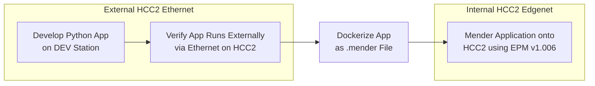

# HCC2 REST Sample Python Application Template

## Revision v1.1
---

### Functionality
This HCC2 python application template supports the following HCC2 interactions.

1. HCC2 **[Registration]([https://](https://edgesdk.sensiadigital.net/toc.html))** using either/or premade TAR.GZ configuration files and dynamically added datapoints.
2. HCC2 complex or simple **[Provisioning]([https://](https://edgesdk.sensiadigital.net/toc.html))**.
3. HCC2 **[Message Subscriptions]([https://](https://edgesdk.sensiadigital.net/toc.html))**.
4. General HCC2 REST API utility class

---

### Project Folder
> **NOTE** See __First Time Running__ below for project setup steps.

__samplePythonApplication__/
+-- [api/](api/) 
�   +-- [\_\_init\_\_.py](api/__init__.py)
�   +-- [hcc2_rest_enums.py](api/hcc2_rest_enums.py)
�   +-- [hcc2_rest_schema.py](api/hcc2_rest_schema.py)
�   +-- [hcc2_rest.py](api/hcc2_rest.py)
�
+-- [docs/](examples/)
�   +-- [images/](docs/images/)
�   +-- [changelog.mb](docs/changelog.md)
�
+-- [examples/](examples/)
�   +-- [define_config_datapoints.py](examples/define_config_datapoints.py)
�   +-- [define_general_datapoints.py](examples/define_general_datapoints.py)
�   +-- [define_hcc2_io_monitor_task.py](examples\define_hcc2_io_monitor_task.py)
�   +-- [read_hcc2_io_values.py](examples/read_hcc2_io_values.py)
�   +-- [send_read_complex_message.py](examples/send_read_complex_message.py)
�   +-- [send_read_message.py](examples/send_read_message.py)
�   +-- [send_write_message.py](examples/send_write_message.py)
�   +-- [setup_subscriptions.py](examples\setup_subscriptions.py)
�
+-- [services/](services/)
�   +-- [\_\_init\_\_.py](services/__init__.py)
�   +-- [heartbeat.py](services/heartbeat.py)
�   +-- [provisioning.py](services/provisioning.py)
�   +-- [registration.py](services/registration.py)
�   +-- [subscriptions.py](services/subscriptions.py)
�
+-- [utils/](utils/)
�   +-- [\_\_init\_\_.py](utils/__init__.py)
�   +-- [logs.py](utils/logs.py)
�   +-- [datapoints.py](utils/datapoints.py)
�
+-- [app.py](app.py) __(Main)__
+-- [config.json](config.json) __(Config File)__
+-- [config.py](config.py)
+-- [README.md](README.md)
+-- [requirements.txt](requirements.txt)
+-- [run.py](run.py) __(Application entry)__

---

## Design Process Flowchart
> **NOTE** It is easier to run and test your application externally from the HCC2 before packaging it eventually as a mender file and installing using the EPM tool.



---

## First Time Running
#### **Install Python Version 13.1**
> **NOTE** The HCC2 Docker environment uses Python 3.13-Bullseye
- [Python 3.13.1 for Windows](https://www.python.org/downloads/windows/)
- [Python 3.13.1 for macOS](https://www.python.org/downloads/macos/)
<br>

#### **Install Dependencies**
```bash
cd path/to/this/folder
pip install -r "requirements.txt"
```
<br>

#### **Modify Application Configuration File** [config.json](config.json).
Start by renaming the application `name` and `function_name` to your own within the json file. 

> **NOTE** The application function name must be in camel case. Ex. myApp, application, app2

> **NOTE** Leave the unmarked json value as is if unfamiliar for first time setup.  

  ```json
  {
    "app": {
      "name": "Sample Python HCC2 Application", <-- Rename.
      "function_name": "samplePythonApp", <-- Rename (MUST BE CAMEL CASE).
      "version": {
        "major": 1,
        "minor": 0,
        "micro": 0
      },
    "log_level": "info"
    },
    "registration": {
      "static_enabled": true,
      "targz": "./resources/configs/static/first_time_setup.tar.gz", <-- A simple TAR.GZ with 3 config and 1 general data point
      "dynamic_general_enable": false,
      "dynamic_config_enable": false
    },
    "heartbeat": {
      "interval": 30
    },
    "provisioning": {
      "complex": false <-- Leave as false for first time setup (Simple Provisioning)
    },
    "network": {
      "rest_ip_override": "172.17.2.100",
      "app_ip_override": "172.17.2.75"
    },
    "rest_api": {
      "port": 7071,
      "version": 1
    }
  }
  ```
<br>

#### **Configure Unity Network Settings**
Select any of the following methods to connect your DEV station to the HCC2.
<br>

##### **Ethernet 1 Port (DHCP)**
   The HCC2 eth-1 port uses DHCP by default and will be assigned an IP address according to the leasing rules of your router. 
   
   ```json
  {
    "network": {
      "rest_ip_override": "192.168.0.10", <-- Assigned by your Router.
      "app_ip_override": "192.168.0.11" <-- Assigned by your Router / Set to a static IP on HCC2 subnet.
    },
  }
  ```
<br>

##### **Ethernet 2 Port (Static)**
   The HCC2 eth-2 port is static at IP `192.168.1.41` by default. 
   
   ```json
  {
    "network": {
      "rest_ip_override": "192.168.1.41",
      "app_ip_override": "192.168.1.100" <-- Set to your DEV station IP on the same subnet.
    },
  }
  ```
<br>

##### **USB (Static)**
No Unity network configuration is needed if connecting through the top panel USB-C port.
```json
  {
    "network": {
      "rest_ip_override": "169.254.1.1",
      "app_ip_override": "169.254.1.100" <-- Set to your DEV station IP on the same subnet.
    },
  }
```
<br>

#### **Configure Unity Firewall Settings**
   Make sure the port `7071` is open on the HCC2 ethernet port your DEV station is connected to.
   Below is an example of REST API port enabled on available endpoints.
   
   
<br>

#### **Run and Verify Registration**
The application comes with example code to dynamically register a number of different `General` and `Config` data points.
```bash
cd path/to/this/folder
python run.py
```
The output logs should look similar to this. Here the script has static registration enabled and has used `first_time_setup.tar.gz`, which contains 1 config and 1 general data point. It has no dynamic tags defined in [app.py](app.py) so the dynamic registration section is blank. 

The application is now waiting for provisioning. Without provisioning the tasks will not run unless `run_without_provisioning` is set to `True` in [config.json](config.json).
```log
[0][2025-03-12T18:31:28.040354Z][samplePythonApp][INFO] ---------------------------------------------
[0][2025-03-12T18:31:28.040882Z][samplePythonApp][INFO] Sample Python HCC2 Application (v1.0.0)
[0][2025-03-12T18:31:28.041242Z][samplePythonApp][INFO] ---------------------------------------------
[0][2025-03-12T18:31:28.042033Z][samplePythonApp][INFO] Supported REST Container Version 0.1.0-r20250219.3
[0][2025-03-12T18:31:28.042488Z][samplePythonApp][INFO] Supported REST API Definition V1
[0][2025-03-12T18:31:28.042874Z][samplePythonApp][INFO] Waiting For REST Server...
[0][2025-03-12T18:31:28.043184Z][samplePythonApp][INFO] Delaying 10 Seconds : Waiting For Rest Server
[0][2025-03-12T18:31:45.906219Z][samplePythonApp][INFO] REST Server IP: 172.17.2.100
[0][2025-03-12T18:31:45.907110Z][samplePythonApp][INFO] Sample Python HCC2 Application IP: 172.17.2.75
[0][2025-03-12T18:31:45.936824Z][samplePythonApp][INFO] REST Server Found
[0][2025-03-12T18:31:45.937522Z][samplePythonApp][INFO] ---------------------------------------------
[0][2025-03-12T18:31:45.937836Z][samplePythonApp][INFO] Registration
[0][2025-03-12T18:31:45.938193Z][samplePythonApp][INFO] ---------------------------------------------
[0][2025-03-12T18:31:45.938651Z][samplePythonApp][INFO] Static : True
[0][2025-03-12T18:31:45.939100Z][samplePythonApp][INFO] Dynamic General : False
[0][2025-03-12T18:31:45.939557Z][samplePythonApp][INFO] Dynamic Config : False
[0][2025-03-12T18:31:45.947858Z][samplePythonApp][INFO] Registering Existing TAR.GZ ./resources/configs/static/first_time_setup.tar.gz
[0][2025-03-12T18:31:46.016000Z][samplePythonApp][INFO] App Config Loaded samplePythonApp
[0][2025-03-12T18:31:46.034782Z][samplePythonApp][INFO] --------------------------------
[0][2025-03-12T18:31:46.035258Z][samplePythonApp][INFO] Static Data Points
[0][2025-03-12T18:31:46.035750Z][samplePythonApp][INFO] --------------------------------
[0][2025-03-12T18:31:46.036124Z][samplePythonApp][INFO] General:
[0][2025-03-12T18:31:46.036606Z][samplePythonApp][INFO]  - liveValue.production.this.samplePythonApp.0.sampleGeneral.
[0][2025-03-12T18:31:46.037030Z][samplePythonApp][INFO] Config:
[0][2025-03-12T18:31:46.037323Z][samplePythonApp][INFO]  - liveValue.postvalidConfig.this.samplePythonApp.0.sampleConfig.
[0][2025-03-12T18:31:46.037547Z][samplePythonApp][INFO] --------------------------------
[0][2025-03-12T18:31:46.037802Z][samplePythonApp][INFO] Dynamic Data Points
[0][2025-03-12T18:31:46.038011Z][samplePythonApp][INFO] --------------------------------
[0][2025-03-12T18:31:46.364546Z][samplePythonApp][INFO] --------------------------------
[0][2025-03-12T18:31:46.365563Z][samplePythonApp][INFO] Registration complete
[0][2025-03-12T18:31:46.366330Z][samplePythonApp][INFO] Delaying 5 Seconds : Core Application Registration
[0][2025-03-12T18:31:51.370063Z][samplePythonApp][INFO] Delaying 5 Seconds : First Provisioning
[0][2025-03-12T18:31:56.372210Z][samplePythonApp][INFO] ---------------------------------------------
[0][2025-03-12T18:31:56.373175Z][samplePythonApp][INFO] Starting Application samplePythonApp
[0][2025-03-12T18:31:56.374417Z][samplePythonApp][INFO] ---------------------------------------------
[0][2025-03-12T18:31:56.375161Z][samplePythonApp][INFO] ---------------------------------------------
[0][2025-03-12T18:31:56.375715Z][samplePythonApp][INFO] Waiting On Provisioning Data
[0][2025-03-12T18:31:56.376265Z][samplePythonApp][INFO] ---------------------------------------------
[0][2025-03-12T18:31:56.377355Z][samplePythonApp][INFO] Task Heartbeat Task starting
[0][2025-03-12T18:31:56.377907Z][samplePythonApp][INFO] Task Heartbeat Task : unprovisioned
[0][2025-03-12T18:31:56.386967Z][samplePythonApp][INFO] Task Main starting
[0][2025-03-12T18:31:56.402276Z][samplePythonApp][INFO] Task Main : unprovisioned
```
<br>

##### App Configuration Page
The config page contains all defined `Config` datapoints.

If no static or dynamic configuration data points are defined the application will **NOT** have a config page in the `Deploy` tab.


##### App Monitoring Page
The monitoring page contains all defined `General` datapoints.

If no static or dynamic general data points are defined the application will **NOT** have a operate page in the `Operate` tab.


#### **Deploy Application**
Deploy the HCC2. You should see your application name appear in the list of applications.

> **NOTE** Make sure the previous Network and Firewall configurations are still present. Port 7071 must be open on the interface your application is connecting to the HCC2 over.

> **NOTE** If your application has complex provisioning enabled it will need to validate provisioning data and respond with 15 seconds of an HCC2 deployment. If you do not POST a response to the REST API in this time the deployment will fail. See the **Provisioning** section below for details.


Finally, your application's `postvalidConfig` and `up` tags should now appear in the **Unity Live Data** table. 
Filter by your application functionality name in the top left search bar.

> **NOTE** General tags will not appear in Live Data until they are first written to.


---
## JSON Configuration Settings

Configuration setting descriptions for parameters within [config.json](config.json).

> **NOTE** If this application is running in a Docker container with `LOG_LEVEL` set in the Docker Compose file, it will override `log_level`.

### `app`
- **`name`**: Application name. Rename as needed.  
- **`function_name`**: The function name of the application. Must be in **camel case**.  
- **`version`**: Defines the application's versioning with `major`, `minor`, and `micro` values.  
- **`log_level`**: Logging level; `info`, `debug`, `error`, `warning`, `critical`.  

### `registration`
- **`static_enabled`**: Enables static registration for the application use the provided `TAR.GZ` file.  
- **`targz`**: Path to a `TAR.GZ` config file typically made in the App Config Editor.  
- **`dynamic_general_enable`**: Enables dynamic general registration (recommended to keep `false` for initial setup).  
- **`dynamic_config_enable`**: Enables dynamic configuration registration (recommended to keep `false` for initial setup).  

### `heartbeat`
- **`interval`**: Heartbeat interval in seconds.  

### `provisioning`
- **`complex`**: `false` : Simple Provisioning, `true` : Complex Provisioning

### `network`
- **`rest_ip_override`**: IP address override for the REST interface. Specify if connecting to the HCC2 externally (ie Eth1/2). 
- **`app_ip_override`**: IP address override for the device running this application. Specify if connecting to the HCC2 externally.   

### `rest_api`
- **`port`**: Port number for the REST API.  
- **`version`**: API version number.  

---

## Tasks

Tasks are threaded execution loops that repeat the code within their `execute` method.

### Adding Tasks

To add a task create a class which inherits the `Task` base class, and define your specific logic within the `execute` method. The `Task` base class handles looping the `execute` method as well as determining if the task should be running while unprovisioned or not, controlled by `run_unprovisioned`.

> **NOTE** For a full example see [define_hcc2_io_monitor_task.py](examples\define_hcc2_io_monitor_task.py)

```python
class Task1(Task):
    """Thread task 1."""

    def __init__(self, run_unprovisioned=True):
        super().__init__("Task 1", run_unprovisioned)
        self.api = RestAPI()

    def execute(self):
        """Thread task 1 loop function"""

        # Add task logic here.
        time.sleep(1)
```

Then at the bottom of [app.py](app.py), instantiate the task and `start` it.

```python
#                      Start Application Task Loop
# =========================================================================
info_banner(f"Starting Application {AppConfig.app_func_name}")

if not Provisioning.is_provisioned:
    info_banner("Waiting On Provisioning Data")

# Init task classes
try:
    task1 = Task1()
    task1.start()

    task2 = Task2()
    task2.start()

except Exception as exc:
    hcc2_logger.info(f"{AppConfig.app_func_name} failed due to exception: {exc}")
    hcc2_logger.info(f"Stopping {AppConfig.app_func_name}.")

    task1.stop()
    task2.stop()

    time.sleep(10) # Prevent rapid restarting on error
    sys.exit(ExitCode.UNEXPECTED_ERROR)
```

---

## Provisioning

Provisioning is the method of which data entered into Unity configuration pages transfers to applications within the HCC2.

There are two provisioning methods, `Simple` and `Complex`. If an application is set as complex provisioning it will be to watching for new provisioning data to validate and then return a validation result to the HCC2 Rest Server.

For both `Simple` and `Complex` provisioning the latest approved config values are stored within the `PostValidConfig` thread safe data class found in [provisioning.py](services\provisioning.py). This class will only ever contain validated, post deployment HCC2 configuration data; therefore it should be the only source of configuration data for your application.

All configuration values can be accessed though the class level `value` method.

Configure values in Unity and Deploy. If the application is running the provisioning thread will notice new config data and load this in the `PostValidConfig` class.


```log
[0][2025-03-12T23:17:30.124746Z][samplePythonApp][INFO] ---------------------------------------------
[0][2025-03-12T23:17:30.138488Z][samplePythonApp][INFO] Provisioning : Simple
[0][2025-03-12T23:17:30.144915Z][samplePythonApp][INFO] ---------------------------------------------
[0][2025-03-12T23:17:30.196002Z][samplePythonApp][INFO] Provisioning complete. Result Pass
[0][2025-03-12T23:17:30.198964Z][samplePythonApp][INFO] Reading All Post Valid Config Values.
[0][2025-03-12T23:17:31.284260Z][samplePythonApp][INFO] Current Post Valid Config:
[0][2025-03-12T23:17:31.285388Z][samplePythonApp][INFO]  - sampleConfigInt : 444
[0][2025-03-12T23:17:31.287436Z][samplePythonApp][INFO]  - sampleConfigFloat : 675.255
[0][2025-03-12T23:17:31.288282Z][samplePythonApp][INFO]  - sampleConfigString : my sample string
```

Access this data by importing the `PostValidConfig` class and calling the `value` method with a configuration register's topic.

> **NOTE** The name used to reference the config register is the topic name, with all `.` replace with `_`.

```python
from services import PostValidConfig

print(PostValidConfig.value("sampleConfigInt"))
print(PostValidConfig.value("sampleConfigFloat"))
print(PostValidConfig.value("sampleConfigString"))
```

```bash
>> 444
>> 675.255
>> my sample string
```

<br>

#### **Simple Provisioning**
Simple provisioning is the easiest way for REST applications to register with the HCC2. It works if the config only includes safe, passive settings. Without harmful parameters, validation is minimal since improper values won�t cause critical issues.

Set `complex` as `false` within [config.json](config.json).
```json
  "provisioning": {
    "complex": false
  },
```

Your application will **not** have to reply during HCC2 deployments; new config data is automatically accepted. The `PostValidConfig` class both within [provisioning.py](services\provisioning.py) will be updated with the new configuration values shortly after.
<br>

#### **Complex Provisioning**
Complex provisioning is for applications requiring stricter validation to prevent harmful configurations. For example, a voltage output level setting is best handled through complex provisioning, where values outside safe bounds can be rejected.

Set `complex` as `true` within [config.json](config.json).

```json
  "provisioning": {
    "complex": true
  },
```
Your application **MUST** parse the prevalid configuration configuration data and return a validation result. This pre-valid data is read in from a json file, `parameters.this.0.json`, found within the provisioning `TAR.GZ` file.

Example pre-valid configuration data.

```json
{
    "enabledVoltOut": true,
    "voltageSet": 24,
    "enabledCurrIn": true,
    "currentLimit": 1,
    "cyclePeriodSec": 3,
    "dutyCycle": 50,
    "offset": -18,
    "smsNumber": "+1 555-123-4567",
    "appSettings": "{\"settings\": [{\"settingName\": \"PressureThreshold\", \"value\": 3500}]}",
    "hash": "5a11bcbf7acfed636c42b6f2684128dfaaf53278723fb9aec0a85ee94bb58156"
}
```

Add validations to the `complex_provisioning_validation` function within [app.py](app.py). If the pre-valid config is valid this function should return `True` and the HCC2 deployment should succeed. If the config is invalid return `False`; this will prevent the HCC2 deployment from occurring and show your application as the cause.

Once fully deployed, the `Provisioning` class will update the thread safe `PostValidConfig` class both within [provisioning.py](services\provisioning.py).

> **NOTE** This function will have to execute and return in under 15 seconds or the HCC2 deployment will fail due to this application `PENDING`.

```python
def complex_provisioning_validation(self : Provisioning) -> bool:
    """Custom provisioning validation logic if complex provisioning is enabled.

    Add your validation logic for the values of CONFIG DATAPOINTS ONLY.
    
    If simple provisioning is enabled this function will be skipped and any incoming 
    pre-valid configuration values will be automatically accepted."""

    # Read in pre-valid configuration file (parameters_this_0.json) from provisioning TAR.GZ file.
    pvc = self.pre_valid_config

    # Set Voltage must be less than 24 volts
    if pvc['voltageSet'] > 24.0:
        hcc2_logger.error(f"Validation Error: Set voltage ({pvc['voltageSet']} V) must be less than or equal to 24 Volts.")
        return False

    # Current limit must be between 0.5 and 2 Amps
    if not (0.5 <= pvc['currentLimit'] <= 2.0):
        hcc2_logger.error(f"Validation Error: Current limit ({pvc['currentLimit']} A) must be between 0.5 and 2 Amps.")
        return False

    # Polling period must be greater than or equal 1 second
    if pvc['cyclePeriodSec'] < 1:
        hcc2_logger.error(f"Validation Error: Polling period ({pvc['cyclePeriodSec']} s) must be greater than or equal 1 Seconds.")
        return False

    # Either voltage out or current in must be true
    if not (pvc['enabledVoltOut'] or pvc['enabledCurrIn']):
        hcc2_logger.error(f"Validation Error: Either voltage out or current in must be True.")
        return False

    hcc2_logger.info("Provisioning Validation Successful")
    return True
```

---

## Registration
Registration is the initial action executed by this project. Running it multiple times will simply overwrite the previous application instance, as long as the `function_name` in [config.json](config.json) have remained the same.

Registration can be combination of both opening an existing `TAR.GZ` config file and appending on additional datapoints defined within the `DataPoints` class within [app.py](app.py).

The registration method can be configured in [config.json](config.json).

> **NOTE** Ensure the static `TAR.GZ` file path is specified using Linux-style formatting (with forward slashes).

```json
  {
    "app": {
      "name": "Sample Python HCC2 Application", 
      "function_name": "samplePythonApp", 
      "version": {
        "major": 1,
        "minor": 0,
        "micro": 0
      },
      "log_level": "info"
    },
    "registration": {
      "static_enabled": true,  <-- Enable static registration
      "targz": "./resources/configs/static/samplePythonApp.tar.gz", <-- Static TAR.GZ config file path
      "dynamic_general_enable": true, <-- Enable GENERAL dynamic registration
      "dynamic_config_enable": true <-- Enable CONFIG dynamic registration
    },
    ...
  }
  ```

#### **Static Only**
The python application will only attempt to register the provided `TAR.GZ` configuration file. If the file is not found a blank application will be registered instead.

> **NOTE** Ensure the static `TAR.GZ` file path is specified using Linux-style formatting (with forward slashes).

```json
"registration": {
  "static_enabled": true,
  "targz": "./resources/configs/static/samplePythonApp.tar.gz",
  "dynamic_general_enable": false,
  "dynamic_config_enable": false
}
```

#### **Dynamic Config / General Only**
The python application will initialize a blank application and attempt to define each general and/or config data point within the shared DataPoint class `general` and `config` dictionaries. Any provided `TAR.GZ` files will be ignored.

```json
"registration": {
  "static_enabled": false,
  "targz": "",
  "dynamic_general_enable": true,
  "dynamic_config_enable": true
}
```

#### **Static & Dynamic**
The python application will only attempt to open the provided `TAR.GZ` configuration file in the HCC2 REST App Creator. If the file is not found a blank application will be opened instead.

The application will then attempt to define each general and config data point defined within shared DataPoint class `general` and `config` dictionaries before finally registering the application.

> **NOTE** Ensure the static `TAR.GZ` file path is specified using Linux-style formatting (with forward slashes).

```json
"registration": {
  "static_enabled": true,
  "targz": "./resources/configs/static/samplePythonApp.tar.gz",
  "dynamic_general_enable": true,
  "dynamic_config_enable": true
}
```
<br>

### Creating a `TAR.GZ` Configuration File

> **TODO**: Find and link `AppConfigEditor (ACE)` documentation.

<br>

### Adding Dynamic Data Points
To add general or config data points call the `add_general` or `add_config` method of the `DataPoints` class.

All dataclasses, such as `GeneralDataPoint` and `ConfigDataPoint`, are found within [hcc2_rest_schema.py](api/hcc2_rest_schema.py)

> **NOTE** All General and Config data points must be added **before** registration.

> **NOTE** For more examples see [define_general_datapoints.py](examples/define_general_datapoints.py) and [define_config_datapoints.py](examples/define_config_datapoints.py).

```python
from utils import DataPoints

from api.hcc2_rest_schema import (
    TagMetadata, TagUnityUI, 
    GeneralDataPoint, ConfigDataPoint
)

# Add General Data Point : Int32 Input
DataPoints.add_general(

    GeneralDataPoint(
        tagSubClass=TagSubClass.PRODUCTION,
        topic="inputs.int32In",
        metadata=TagMetadata(
            dataType=TagDataType.INT32,
            unit=UnitType.NONE,
            isInput="true",
            isOutput="false"
        ),
        unityUI=TagUnityUI(
            displayName="Int32 Input",
            shortDisplayName="int32In",
            uiSize="3"
        )
    )
)

# Add Config Data Point : Current Limit
DataPoints.add_config(

    ConfigDataPoint(
        topic="currentLimit",
        defaultValue="1.0",
        metadata=TagMetadata(
            dataType=TagDataType.FLOAT,
            unit=UnitType.CURRENT
        ),
        unityUI=TagUnityUI(
            displayName="Current Limit",
            shortDisplayName="currLimit",
            uiSize="3"
        )
    )
)
```
<br>

### Accessing General Data Points
General data points define either dynamically or statically are available in the `DataPoint` class to access. 
This is most useful for quickly getting the fully qualified tag name which is required for reading and writing to/from data points.

An example dynamically defined data point.

```python
DataPoints.add_general(

    GeneralDataPoint(
        tagSubClass=TagSubClass.PRODUCTION,
        topic="inputs.int32In",
        metadata=TagMetadata(
            dataType=TagDataType.INT32,
            unit=UnitType.NONE,
            isInput="true",
            isOutput="false"
        ),
        unityUI=TagUnityUI(
            displayName="Int32 Input",
            shortDisplayName="int32In",
            uiSize="3"
        )
    )
)
```

An example statically defined data point within ACE.


Assuming `static_enabled` and `dynamic_general_enable` are enabled and `targz` is a valid `TAR.GZ` config file within [config.json](config.json), then both the dynamic and static registers can be accessed through the `DataPoints` class.

```python
from utils import DataPoints

# Access general tags fully qualified tag from either the .fqn attribute or resolving the class instance as a string.

# Dynamic Register (By Topic) (periods replaced with underscores, ie inputs.int32In -> inputs_int32In
print(DataPoints.general.inputs_int32In)
print(DataPoints.general.inputs_int32In.fqn)

# Static Registers (By Datapoint Name)
print(DataPoints.general.sampleGeneral)
print(DataPoints.general.sampleGeneral.fqn)
```
<br>

### Reading And Writing General Data Points
Read and write values to your general data points by accessing the general tags FQN from the `DataPoints` class.
> **NOTE** For more examples see [send_read_message.py.py](examples\send_read_message.py) and [send_write_message.py](examples\send_write_message.py).

##### Reading General Data Points
```python
from utils import DataPoints
from api import RestAPI

rest_api = RestAPI()

# Read the general data point value
messages = rest_api.rest_api.message_read_simple([

    # Passed a list of FQN accessible from the DataPoints class
    DataPoints.general.inputs_int32In.fqn,
    DataPoints.general.sampleGeneral.fqn
])

# Print out the read results
print(f"inputs_int32In    : {messages[0].value}")
print(f"sampleGeneral     : {messages[1].value}")
```
<br>

##### Writing General Data Points
```python
from utils import DataPoints
from api import RestAPI, SimpleMessage

# Create simple messages
simple_msg_1 = SimpleMessage(DataPoints.general.inputs_int32In.fqn, 800)
simple_msg_2 = SimpleMessage(DataPoints.general.sampleGeneral.fqn, 30000)

# Send write request (List of SimpleMessages)
response = rest_api.message_write_simple([

    # Add Simple Messages
    simple_msg_1,
    simple_msg_2
])

# Check response
if response.ok:
    print("All message written!")
```

---

## Subscriptions
Subscriptions allow the HCC2 to POST tag topic updates to your application when they become available. The python application must create start a server which listens and responds to HTTP POST methods of `SimpleMessage` JSON objects.

Using the `Subscriptions` class within [subscriptions.py](services\subscriptions.py), each new subscription will,
- Allocate a new TCP port (14000-14100).
- Establish a subscription with the HCC2 Rest Server.
- Start a Flask server listening for the callback URI.

Subscription data will be packed as a `SimpleMessage` object and put into a FIFO queue.

### Usage
```python
# 1) Subscribe to a tag topic
Subscriptions.subscribe("liveValue.diagnostics.this.io.0.digitalIoIn.ch1.")

# 2) Use various methods to receive data
# Get next value from queue
di1_state_message = Subscriptions.active["liveValue.diagnostics.this.io.0.digitalIoIn.ch1."].get()

# Get latest value discarding older values from queue
di1_state_message = Subscriptions.active["liveValue.diagnostics.this.io.0.digitalIoIn.ch1."].latest()

# 3) Unpack message
if di1_state_message is not None:

  di1_state_value = di1_state_message.value
  di1_state_quality = di1_state_message.quality
  di1_state_timestamp = di1_state_message.timeStamp
```
<br>

### Subscriptions Setup 
#### External PC Program
Ensure your DEV station IP matches what you have defined as `app_ip_override` in [config.json](config.json).
```json
"network": {
  "rest_ip_override": "172.17.2.100", <-- HCC2 IP Address
  "app_ip_override": "172.17.2.75" <-- Dev Station IP Address
},
```


Allow for the subscription port range in inbound firewall settings.


#### Docker Container Program
The Docker YML file will need ports 14000 - 14100 exposed for subscriptions to work.
An example docker compose file.
```yml
---
version: '3.7'

services:
  samplePythonApp:
    image: samplepythonapp:v1.0.0
    container_name: samplePythonApp
    restart: on-failure
    expose:
    - 14000-14100
    volumes:
    - samplePythonApp_vol:/app/data:rw
    networks:
    - edgenet
    environment:
      LOG_LEVEL: info
    tmpfs:
    - /temp:uid=5678,gid=5678
      
networks:
  edgenet:
    name: edgenet

volumes:
  samplePythonApp_vol:
    name: samplePythonApp_vol

...
```

---

## Docker 

### Docker Build

To build the image with the included Dockerfile, use:

```
docker build -t samplepythonapp:v1.0.0
```
To test the image successfully starts up, use:

```
docker run samplepythonapp:v1.0.0 
```

### Using Environment Variables

Add environment variables into the docker compose file, [samplePythonApp.yml](samplePythonApp.yml).

The provided example compose file contains one environment variable already, `LOG_LEVEL`. If this environment variable is not present [config.py](config.py) will take the value `log_level` from [config.json](config.json) instead.

```yml
---
version: '3.7'

services:
  samplePythonApp:
    image: samplepythonapp:v1.0.0
    container_name: samplePythonApp
    restart: on-failure
    expose:
    - 14000-14100
    volumes:
    - samplePythonApp_vol:/app/data:rw
    networks:
    - edgenet
    environment:
      LOG_LEVEL: info
      SAMPLE_VAR_1: 600
      SAMPLE_VAR_2: 75.56
      SAMPLE_VAR_3: Sample String
    tmpfs:
    - /temp:uid=5678,gid=5678
      
networks:
  edgenet:
    name: edgenet

volumes:
  samplePythonApp_vol:
    name: samplePythonApp_vol

...
```

These environment variables are now accessible within the python application.

```python
print( os.getenv('LOG_LEVEL') )
print( os.getenv('SAMPLE_VAR_1') )
print( os.getenv('SAMPLE_VAR_2') )
print( os.getenv('SAMPLE_VAR_3') )
```
```bash
>> info
>> 600
>> 75.55
>> Sample String
```
<br>

### Using Docker Volumes

In the provided example docker compose file, [samplePythonApp.yml](samplePythonApp.yml), a single read/write volume is specified.

```yml
---
version: '3.7'

services:
  samplePythonApp:
    volumes:
    - samplePythonApp_vol:/app/data:rw

volumes:
  samplePythonApp_vol:
    name: samplePythonApp_vol

...
```

Read and write to this directory, `/app/data/` within the python application.

```python
file_path = '/app/data/sample.txt'

# Write to the file
with open(file_path, 'w') as file:
    file.write('This is a sample text file.')

# Read from the file
with open(file_path, 'r') as file:
    content = file.read()

print('File content:', content)
```

Create subdirectories within `/app/data` within the python application.

```python
import os
import csv

# Create subdirectories within /app/data/
text_sub_dir = '/app/data/text_files/'
csv_sub_dir = '/app/data/csv_files/'
os.makedirs(text_sub_dir, exist_ok=True)
os.makedirs(csv_sub_dir, exist_ok=True)

# File paths
text_file_path = os.path.join(text_sub_dir, 'sample.txt')
csv_file_path = os.path.join(csv_sub_dir, 'data.csv')

# Write to the text file
with open(text_file_path, 'w') as file:
    file.write('This is a sample text file in a subdirectory.')

# Read from the text file
with open(text_file_path, 'r') as file:
    content = file.read()

print('Text file content:', content)

# Sample CSV data
csv_data = [
    ['Name', 'Age', 'City'],
    ['Alice', 30, 'New York'],
    ['Bob', 25, 'Los Angeles'],
    ['Charlie', 35, 'Chicago']
]

# Write to the CSV file
with open(csv_file_path, 'w', newline='') as file:
    writer = csv.writer(file)
    writer.writerows(csv_data)

# Read from the CSV file
with open(csv_file_path, 'r') as file:
    reader = csv.reader(file)
    csv_content = list(reader)

print('CSV file content:')
for row in csv_content:
    print(row)
```
